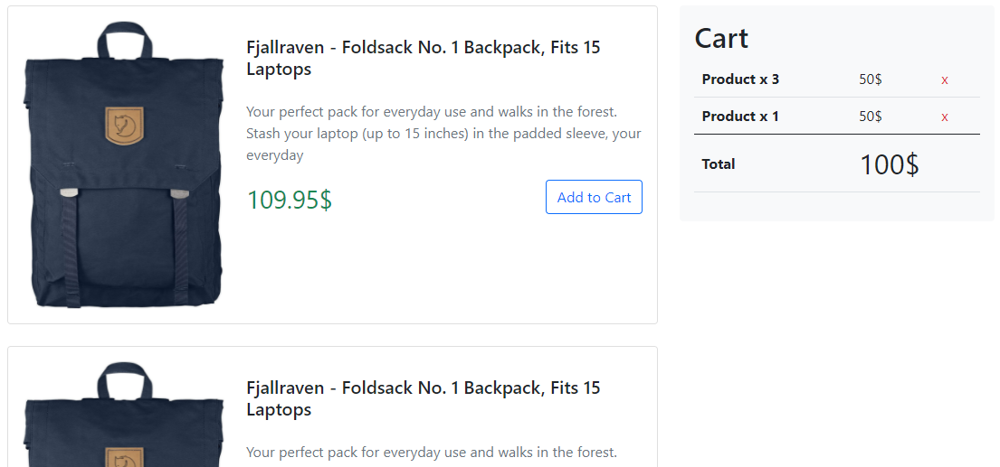

# Go Digital - React Assignment

1. Clone this repository to get the starter files.
2. Create a simple web page to list product cards, and a side cart widget, as shown in the image above. 
3. Fetch the products list from the following remote source: (https://fakestoreapi.com/products).
4. Write the required JavaScript code that add the product to the cart widget when the user clicks on the “Add to Cart” button and update the cart total amount. 
5. Add a “remove” button to each product listed in the cart to remove the product from the cart and update the cart total amount. 
6. Create a GitHub repository “js-shopping-cart" and upload your final code into it.